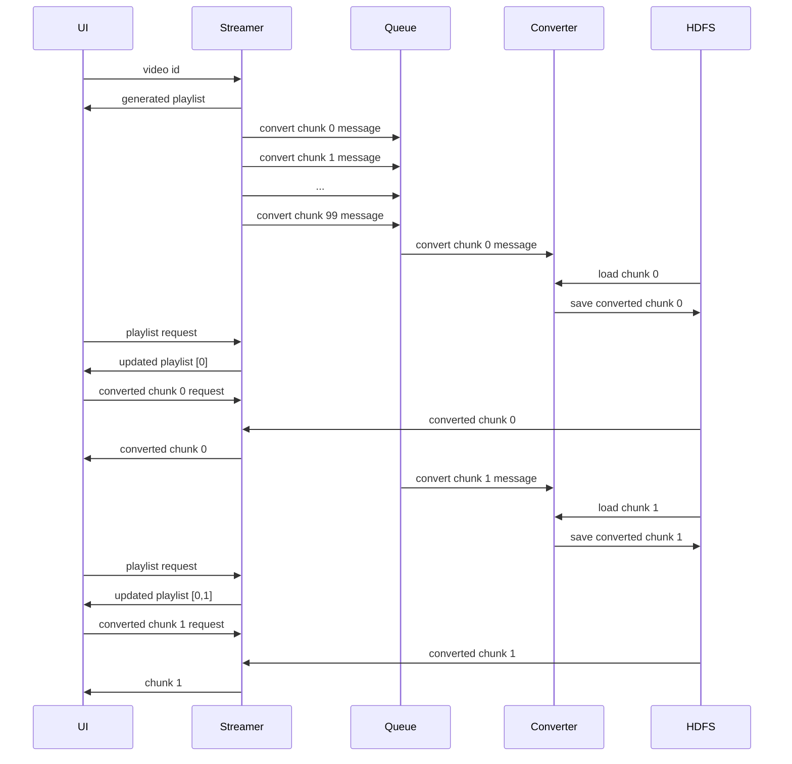

###Local video conversion sequence diagram
                    

```mermaid
sequenceDiagram
    participant UI
    participant Streamer
    participant Queue
    participant Converter
    participant HDFS


UI->>Streamer: video id 
Streamer->> UI: generated playlist 
Streamer->> Queue: convert chunk 0 message
Streamer->> Queue: convert chunk 1 message
Streamer->> Queue: ...
Streamer->> Queue: convert chunk 99 message
Queue->> Converter: convert chunk 0 message
HDFS->> Converter: load chunk 0
Converter->> HDFS: save converted chunk 0
UI->>Streamer: playlist request
Streamer->> UI: updated playlist  [0]
UI->> Streamer: converted chunk 0 request
HDFS->> Streamer: converted chunk 0
Streamer->> UI: converted chunk 0
Queue->> Converter: convert chunk 1 message
HDFS->> Converter: load chunk 1
Converter->> HDFS: save converted chunk 1
UI->> Streamer: playlist request
Streamer->> UI: updated playlist [0,1]
UI->> Streamer: converted chunk 1 request
HDFS->> Streamer: converted chunk 1
Streamer->> UI: chunk 1
```

###End
